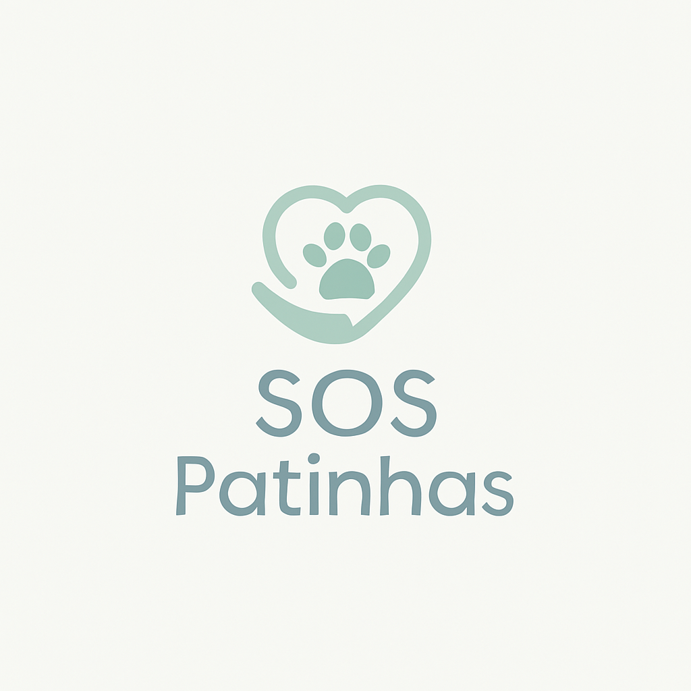

# SOS Patinhas - Projeto Desenvolvimento Front-End Para Web/Análise e Desenvolvimento de Sistemas
Projeto de Front-End acadêmico para a ONG SOS Patinhas. Desenvolvido em HTML, CSS e JavaScript, este website responsivo apresenta a missão da ONG e funcionalidades essenciais como página inicial moderna, visualização de projetos de adoção e formulários de cadastro. Foco na usabilidade e na implementação de uma interface limpa e intuitiva.

 Projeto de desenvolvimento front-end para a disciplina Desenvolvimento Front-End Para Web do curso de Análise e Desenvolvimento de Sistemas. O objetivo foi criar um site responsivo e interativo para uma ONG fictícia de resgate de animais, aplicando conceitos de HTML5 semântico, CSS3 avançado (Flexbox, Grid, Variáveis) e JavaScript moderno (Manipulação do DOM, Eventos, Templates).

## ✨ Funcionalidades Implementadas

* **Página Inicial (index.html):** Apresentação da ONG, Gráfico de Impacto.
* **Página de Projetos (projetos.html):** Detalhamento das ações da ONG (Resgate, Saúde, Adoção) com carrosséis de imagens dinâmicos.
* **Página de Cadastro (cadastros.html):** Formulário completo para voluntários e doadores com:
    * Validação de campos em tempo real (Nome Completo, E-mail, CPF, Telefone).
    * Feedback visual para campos inválidos.
    * Mensagem de sucesso/erro ao tentar enviar.
* **Navegação Responsiva:** Menu principal adaptável com submenu dropdown (desktop) e menu hambúrguer (mobile).
* **Componentes Reutilizáveis:** Cards, Botões com estados (hover, active, focus, disabled), Badges, Alerts, Modal (estrutura CSS pronta).

## 🚀 Tecnologias Utilizadas

* **HTML5:** Estruturação semântica do conteúdo.
* **CSS3:**
    * Layout Responsivo (Mobile First) com Flexbox e Grid Layout (Sistema de 12 colunas).
    * Variáveis CSS (Custom Properties) para Design System (cores, fontes, espaçamentos).
    * Estilização avançada de componentes.
    * 5 Breakpoints responsivos definidos.
* **JavaScript (ES6+):**
    * Manipulação do DOM para interatividade.
    * Gerenciamento de Eventos (cliques, blur, submit).
    * Sistema de Templates JavaScript para geração dinâmica do Carrossel.
    * Validação de formulários.
* **Chart.js:** Biblioteca para criação do gráfico de impacto.
* **Git & GitHub:** Versionamento de código, organização de projeto (Issues, Commits).

## 🧑‍💻 Autor

* **Eduardo Cortes Bica**
* **Contato:** http://www.linkedin.com/in/EduardoCBica

---

*Projeto desenvolvido como parte da avaliação da disciplina Desenvolvimento Front-End Para Web/Análise e Desenvolvimento de Sistemas em [10/2025].*